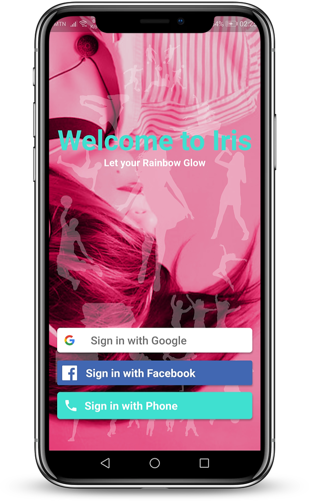
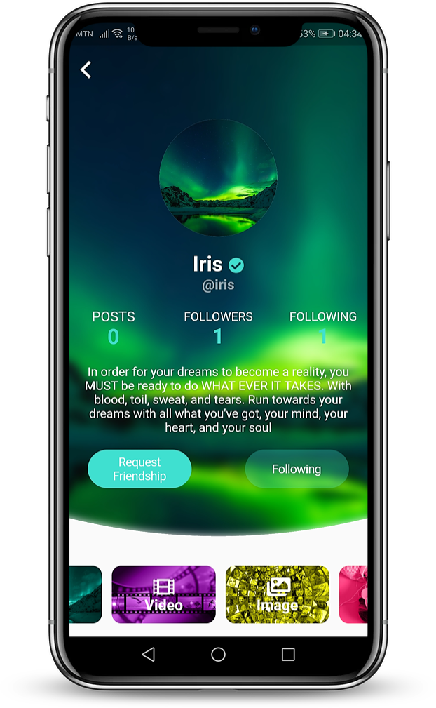
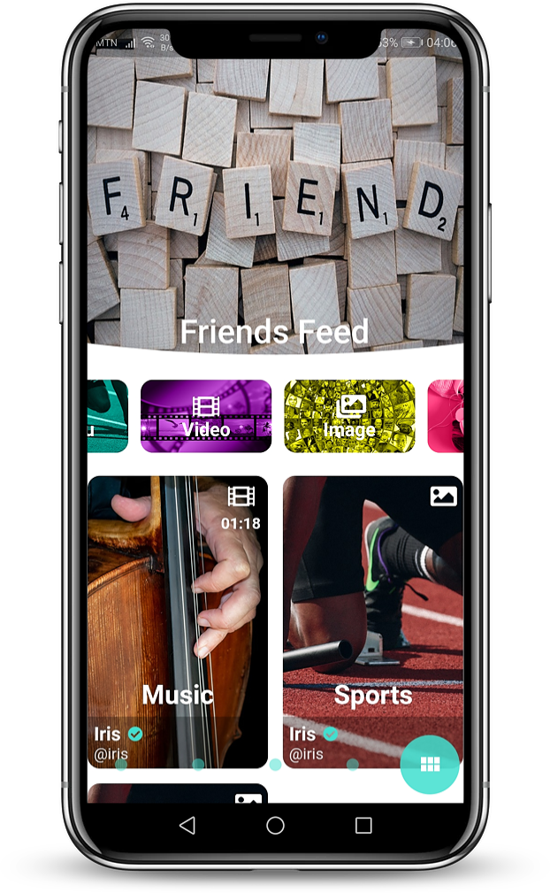
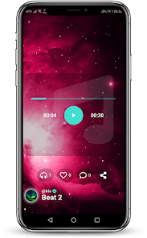
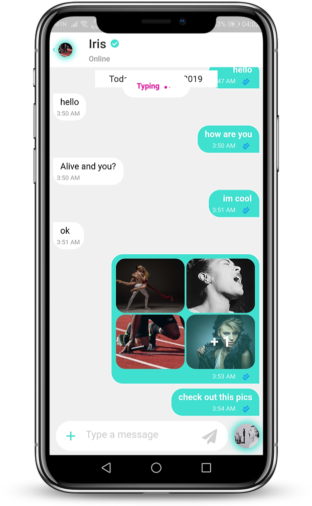
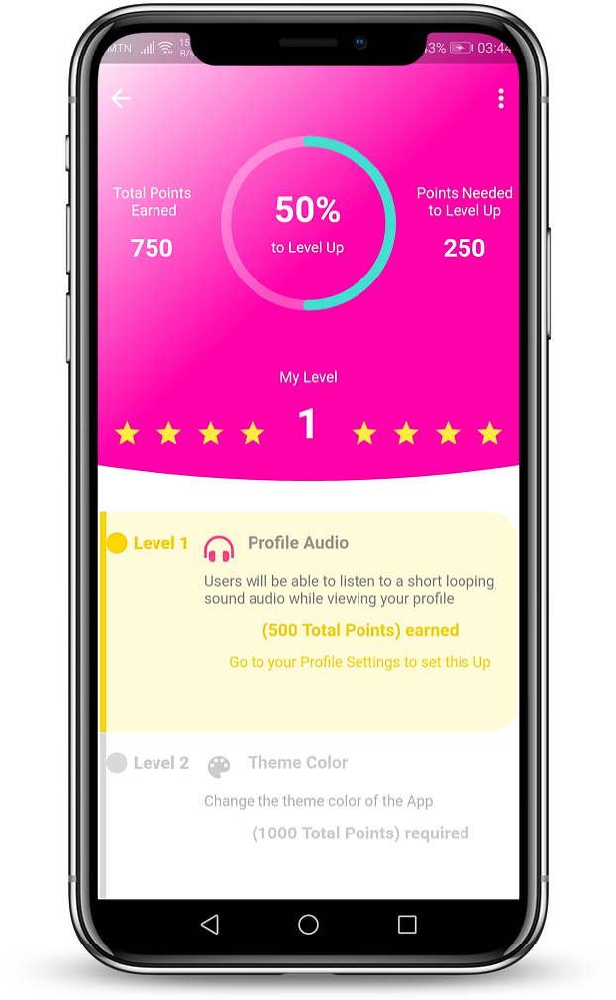

# iris-social-network
A Gamified Social network platform

Download Android App at: https://play.google.com/store/apps/details?id=com.iris.socialnetwork

<iframe title="vimeo-player" src="https://player.vimeo.com/video/800210722?h=c8233789cc" width="640" height="1329" frameborder="0" allowfullscreen></iframe>

 
<table>
  <tr>
    <td></td>
    <td></td>
    <td></td>
  </tr>
  <tr>
    <td></td>
    <td></td>
    <td></td>
  </tr>
 </table>

## Getting Started

A few resources to get you started if this is your first Flutter project:

- [Lab: Write your first Flutter app](https://flutter.dev/docs/get-started/codelab)
- [Cookbook: Useful Flutter samples](https://flutter.dev/docs/cookbook)

For help getting started with Flutter, view this
[online documentation](https://flutter.dev/docs), which offers tutorials,
samples, guidance on mobile development, and a full API reference.
